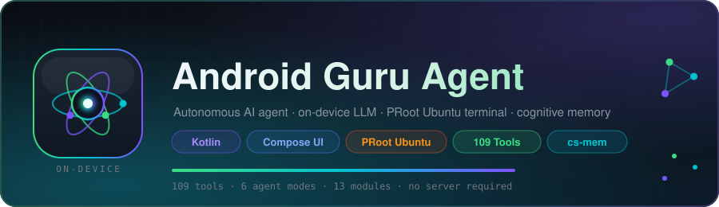
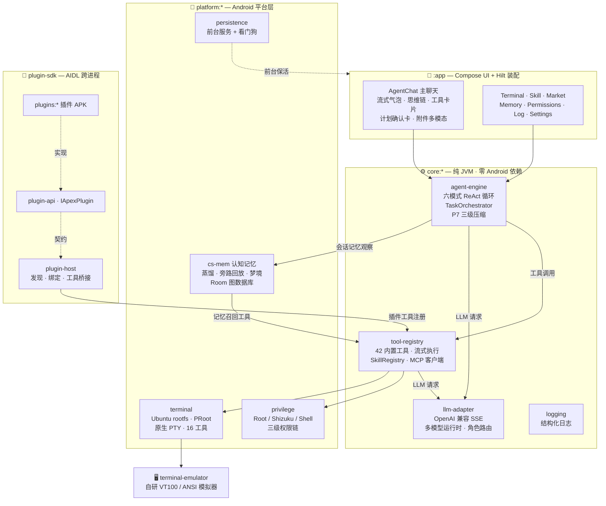
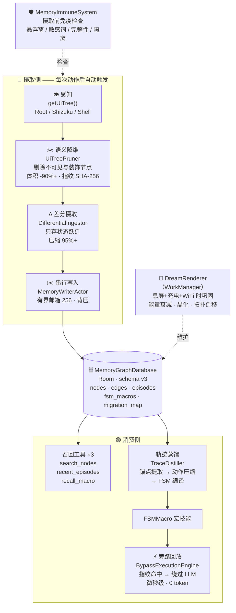
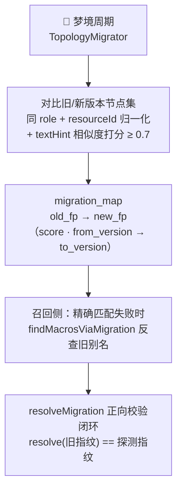
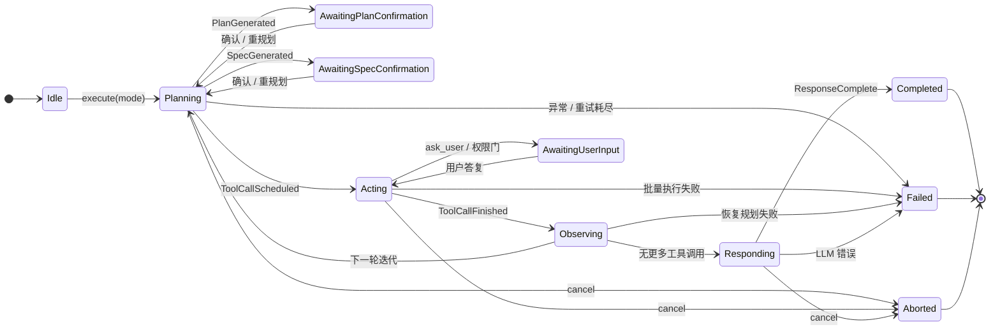
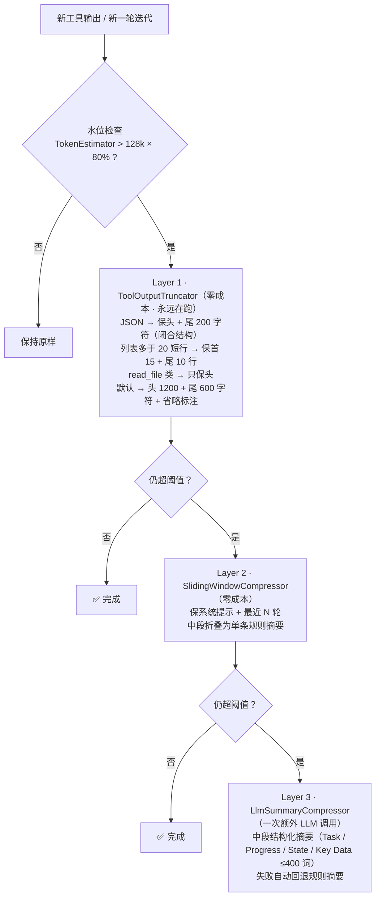

<a id="readme-top"></a>
<div align="center">



# Android Guru Agent

### 🤖 原生于 Android 的自主智能体 —— 设备上的大脑、终端、与肌肉记忆

**An autonomous AI agent that lives entirely on your Android device.**

一个开源的 Android 端自主智能体应用：OpenAI 兼容流式 LLM 接入、6 种执行模式、
83 个内置工具、PRoot 沙箱化 Ubuntu 终端、仿生认知记忆系统（差分摄取 → 轨迹蒸馏 →
FSM 旁路回放 → 梦境巩固）、Root/Shizuku/无障碍三级权限链、插件化 SDK ——
全部跑在一台手机上，无需任何服务器。

**CI · 质量门禁 · 贡献**

<a href="https://github.com/AceGuru-mjh/Android-Guru-Agent/actions/workflows/ci.yml"></a>
<a href="https://github.com/AceGuru-mjh/Android-Guru-Agent/actions/workflows/quality-gate.yml"></a>
<a href="#contributing"></a>


**技术栈**


**仓库动态**

<a href="https://github.com/AceGuru-mjh/Android-Guru-Agent/stargazers"></a>
<a href="https://github.com/AceGuru-mjh/Android-Guru-Agent/network/members"></a>
<a href="https://github.com/AceGuru-mjh/Android-Guru-Agent/issues"></a>
<a href="https://github.com/AceGuru-mjh/Android-Guru-Agent/pulls"></a>
<a href="https://github.com/AceGuru-mjh/Android-Guru-Agent/graphs/contributors"></a>


<a href="https://github.com/AceGuru-mjh/Android-Guru-Agent/search?l=kotlin"></a>

**项目事实**

<a href="#tools"></a>
<a href="#engine"></a>
<a href="#architecture"></a>
<a href="#testing"></a>
<a href="#cs-mem"></a>
<a href="#terminal-runtime"></a>


**快速跳转**

<a href="https://github.com/AceGuru-mjh/Android-Guru-Agent/actions/workflows/ci.yml"></a>
<a href="#quickstart"></a>
<a href="#docs-index"></a>
<a href="#faq"></a>
<a href="#glossary"></a>

</div>

---

## 📖 目录

<table>
<tr>
<td valign="top" width="50%">

**核心能力**
- [✨ 项目亮点](#highlights)
- [🆚 与其他方案对比](#comparison)
- [🏗️ 架构总览](#architecture)
- [🧠 认知记忆系统 cs-mem](#cs-mem)
- [🔄 Agent 引擎与六种工作模式](#engine)
- [🗜️ 上下文工程（P7 三级压缩）](#context-compression)
- [🖥️ 终端运行时（Ubuntu + PRoot）](#terminal-runtime)
- [🌐 浏览器智能体](#browser)
- [🔧 工具全景（83 个）](#tools)
- [⚡ 权限执行链](#privilege)

</td>
<td valign="top" width="50%">

**使用与工程**
- [🧩 技能系统与市场](#skills)
- [💬 斜杠命令](#slash-commands)
- [🔌 插件 SDK](#plugin-sdk)
- [🎨 ComposeFoundry（伴侣工程）](#composefoundry)
- [📱 应用界面](#ui-screens)
- [🚀 快速开始](#quickstart)
- [🧪 测试与质量保障](#testing)
- [📊 CI/CD 流水线](#cicd)
- [📁 仓库结构与代码规模](#structure)
- [🗺️ 路线图](#roadmap) · [📄 文档索引](#docs-index)
- [❓ FAQ](#faq) · [🧭 术语速查](#glossary) · [🤝 贡献指南](#contributing)

</td>
</tr>
</table>

---

<a id="highlights"></a>
## ✨ 项目亮点

| | 亮点 | 说明 |
|:---:|------|------|
| 🧠 | **仿生认知记忆** | UI 感知 → 语义降维（体积压缩 90%+）→ 差分摄取（再压缩 95%+）→ ReAct 轨迹蒸馏为有限状态机 → **0 token 的"肌肉记忆"旁路回放**，App 升级后经拓扑同胚迁移保鲜 |
| 🛡️ | **记忆免疫系统** | 悬浮窗钓鱼 / 无障碍劫持 / 记忆中毒防御：敏感词分级 + 结构完整性校验 + 可疑指纹隔离（Quarantine） |
| 🌙 | **梦境渲染** | 息屏 + 充电 + WiFi 时后台巩固记忆：低能宏保鲜验证、能量衰减、跨版本拓扑迁移（借鉴人类睡眠记忆巩固） |
| 🔥 | **能量遗忘与晶化** | 每条记忆带能量值：使用增能、时间衰减、低能坍缩删除；能量≥8 且成功率≥90% 的高频宏**晶化为 ROM 级永久技能**，免疫衰减与剪枝 |
| 🖥️ | **真·Linux 终端** | 设备上供给 Ubuntu 24.04 官方 rootfs，PRoot 用户态沙箱执行 + 原生 C++ PTY（forkpty/JNI）+ 自研 VT100/ANSI 模拟器，`apt install`、跑 bash 脚本皆可 |
| 🔀 | **双引擎工作流** | 直连 ReAct 引擎 + 任务编排器（状态机/恢复规划/用户交互门/多模型路由）两条执行路径，复杂任务自动上编排 |
| 🗜️ | **上下文工程** | 三级压缩（工具输出智能截断 → 滑动窗口 → LLM 摘要），双引擎统一水位检查，长任务不爆上下文窗口 |
| 🛰️ | **BYO-LLM** | OpenAI 兼容协议 + DeepSeek / OpenRouter / Ollama / 自定义端点预设；多模型运行时按角色路由（含图片自动走 VISION）；原生支持 `reasoning_content` 思维链（R1 / Qwen3-thinking / o 系列） |
| ⚡ | **三级权限链** | Root → Shizuku → 普通沙箱 shell 自动降级选择，无 Root 设备也能执行特权命令 |
| 🧩 | **全插件化** | AIDL 跨进程插件 SDK + 技能市场（工具/技能/MCP/插件/连接器五个货架）+ 40+ 可安装技能模板 |

> [!IMPORTANT]
> **这一切跑在一台普通 Android 手机上。** 不需要服务器，不需要 PC 伴侣，
> 配置任意 OpenAI 兼容 API（或局域网 Ollama）即获得完整的智能体能力。

<p align="right"><a href="#readme-top" title="返回顶部">⬆️ 返回顶部</a></p>

---

<a id="comparison"></a>
## 🆚 与其他方案对比

| 维度 | **Android Guru Agent** | PC 端编码智能体（Claude Code / OpenHands 等） | 传统自动化工具（Tasker 类） | 手机 AI 聊天 App |
|------|------------------------|--------------------------------|------------------------------|------------------|
| 运行位置 | 📱 全程在设备上 | 💻 PC / 服务器 | 📱 设备上 | ☁️ 云端 |
| 需要服务器/PC | ❌ 不需要 | ✅ 需要 | ❌ 不需要 | ✅（厂商云） |
| LLM 可换性 | ✅ 任意 OpenAI 兼容端点 / 局域网 Ollama | 固定模型或自配 | 无 LLM | ❌ 固定 |
| 执行能力 | 83 工具：shell / 文件 / UI 自动化 / 浏览器 / 终端 | 文件 + shell + web | 规则触发，无推理 | 仅对话 |
| Linux 环境 | ✅ PRoot Ubuntu 24.04 沙箱 | ✅ 宿主 OS | ❌ | ❌ |
| 跨会话记忆 | ✅ 认知记忆：陈述性（语义图）+ 程序性（FSM 宏旁路回放） | 仓库内文件（CLAUDE.md 等） | ❌ | 云端会话 |
| 离线记忆 | ✅ Room 本地图数据库 | — | — | ❌ |
| 特权操作 | Root / Shizuku / 沙箱三级降级 | 宿主用户权限 | 需 Root 的居多 | ❌ |
| 可扩展 | 插件 APK（AIDL）+ 技能 + MCP | MCP 等 | 插件市场 | ❌ |

> [!NOTE]
> 对比基于各方案公开形态的定性归纳；PC 端智能体在代码工程深度上依然更强，
> 本项目的差异化在于**把完整的智能体闭环装进口袋**。

<p align="right"><a href="#readme-top" title="返回顶部">⬆️ 返回顶部</a></p>

---

<a id="architecture"></a>
## 🏗️ 架构总览



**13 个 Gradle 模块**（单一仓库 `settings.gradle.kts`）：

| 模块 | 类型 | 职责 |
|------|:---:|------|
| `:app` | Android App | Compose UI（抽屉导航 8 屏）、Hilt 装配、浏览器/GitHub 工具、悬浮球 |
| `:core:agent-engine` | 纯 JVM | ReAct 引擎（Plan/Build 等六模式）、任务编排器、上下文压缩、会话记忆 |
| `:core:tool-registry` | 纯 JVM | 42 个内置工具 + 工具执行器（流式）+ SkillRegistry + MCP 客户端 |
| `:core:llm-adapter` | 纯 JVM | OpenAI 兼容流式客户端 + 多模型运行时（角色路由/能力校验/错误分类） |
| `:core:logging` | 纯 JVM | 结构化日志（LogCategory/LogLevel/LogRecord） |
| `:platform:privilege` | Android Lib | Root/Shizuku/普通三级权限链 + 无障碍服务 + 进程流工厂 |
| `:platform:persistence` | Android Lib | 前台服务 + WorkManager 看门狗（被杀自动拉起） |
| `:platform:terminal` | Android Lib | 终端运行时 2.0：rootfs 供给、PRoot 后端、原生 PTY、16 个工具 |
| `:platform:cs-mem` | Android Lib | 认知记忆系统（本仓库的差异化核心，见下节） |
| `:terminal-emulator` | Android Lib | 自研 VT100/ANSI 终端模拟器（vendored，ATR Phase 2） |
| `:plugin-sdk:plugin-api` | Android Lib | AIDL `IApexPlugin` + PluginContract 常量 |
| `:plugin-sdk:plugin-host` | Android Lib | 插件发现/绑定/工具桥接 |
| `:plugins:plugin-workflow` | Android App | 参考插件 APK（`workflow/save、execute、list` 三工具） |

> [!NOTE]
> 📌 `ComposeFoundry/` 是**独立的 Gradle 工程**（有自己的 `settings.gradle.kts`），
> 不参与主构建 —— 详见 [ComposeFoundry 章节](#composefoundry)。
> 上图为控制/数据流示意（非严格 Gradle 依赖图）。

<p align="right"><a href="#readme-top" title="返回顶部">⬆️ 返回顶部</a></p>

---
<a id="cs-mem"></a>
## 🧠 认知记忆系统 cs-mem

`platform/cs-mem` 是本项目的差异化核心：它不只是"给 LLM 塞一段历史"，
而是一套把 **屏幕感知转化为可复用程序性记忆** 的完整管线。

### 管线全景



### 记忆的两种形态

| 形态 | 模型 | 产生 | 消费 |
|------|------|------|------|
| **陈述性记忆** | `SemanticNode` 语义图 + `Episode` 情景 + `GraphEdge`（SPATIAL/CAUSAL/SEMANTIC 三类边） | 每次动作后 `CsMemSessionManager.afterAction()` 捕获差分 | `memory_search_nodes` / `memory_recent_episodes` 召回工具；记忆屏可视化 |
| **程序性记忆** | `FSMMacro` 有限状态机宏技能 | 任务成功后 `TraceDistiller.distill()`：锚点提取 → 动作压缩 → FSM 编译 | `BypassExecutionEngine.tryBypass()`：指纹命中即**绕过 LLM 直接回放**（微秒级 / 0 token） |

### 生命周期管理（四个仿生机制）

| 机制 | 组件 | 触发 | 效果 |
|------|------|------|------|
| 🔥 **能量熵增** | `EntropyManager` | 每次梦境周期 | 成功检索/执行 → 能量增加；时间推移 → 指数衰减（艾宾浩斯遗忘曲线） |
| 💎 **晶化** | `EntropyManager.shouldCrystallize` → `crystallizeMacro` | 能量≥8 且成功≥10 次且成功率≥90% | ROM 级固化：免疫衰减/剪枝/删除 |
| 🌙 **梦境渲染** | `DreamRenderer`（WorkManager） | 息屏 + 充电 + WiFi + 电量≥50% | 低能宏随机保鲜验证、全局熵衰减、拓扑同胚迁移 |
| 🛡️ **免疫** | `MemoryImmuneSystem` | 每次摄取前 | 悬浮窗检测 / 敏感词分级 / 结构完整性 / 包名可信分级 / 可疑指纹隔离 |

### 跨版本记忆保鲜（拓扑同胚迁移）

App 升级会改变 UI（resourceId / 布局 / 文案）→ 旧指纹失效 → 宏集体失配。
解法是**别名桥**而不是改写历史：



### 存储演化（schema v3）

- 边 ID 从**帧内自增计数器**改为**内容哈希**（SHA-256(源指纹\|目标指纹\|关系) 前 16 位）——
  同一条拓扑边在任意两帧同 ID，差分语义与跨 Episode 删除才正确；
- v2→v3 Room 迁移：清理历史重复边 + 建 `(episode_id, edge_label)` 唯一索引 + 删除增加 episode 作用域；

> [!WARNING]
> 升级必须显式提供 Room `Migration`，仅降级允许 destructive 重建 ——
> 这是保护长期记忆不被静默清空的硬约束。

> [!TIP]
> 深入阅读：[docs/memory-and-workflow-research.md](docs/memory-and-workflow-research.md)
> —— 对标 MemGPT/Letta、Mem0、A-MEM、Zep/Graphiti、Voyager[^research] 的完整调研与差距分析。

<p align="right"><a href="#readme-top" title="返回顶部">⬆️ 返回顶部</a></p>

---

<a id="engine"></a>
## 🔄 Agent 引擎与六种工作模式

`core:agent-engine` 提供两条执行路径，UI 自动选择：

1. **直连路径 `ApexAgentEngine`** —— 流式 ReAct 循环（Think → Act → Observe → …），
   全事件流输出，适合绝大多数对话式任务；
2. **编排路径 `DefaultTaskOrchestrator`** —— 复杂长任务：任务状态机、
   批量工具执行引擎、失败分类 + 恢复规划器、重试策略、循环检测（LoopDetector）、
   用户交互门（ask_user 挂起等待人工决策）、生命周期事件（SharedFlow）。

### 编排器任务状态机（真实转移）



> [!NOTE]
> 图为 `TaskStateMachine` + `DefaultTaskOrchestrator` / `BatchExecutionEngine`
> 中全部 `transitionTo(...)` 调用的合并视图；`Finished` 是 sealed 终态
> （Completed / Failed / Aborted），终态不可逆。

### 六种模式（`AgentMode`）

| 模式 | 行为 | 适用 |
|------|------|------|
| **Build** | 边想边做，实时执行 | 简单任务、快速响应 |
| **Plan** | 先产出完整计划，用户确认后逐步执行 | 复杂多步操作 |
| **Spec** | 先产出需求规格（目标/需求/约束/验收标准/交付物），确认后逐项执行 | "做什么、做成什么样才算完成" |
| **Reflect** | 生成 → 评审 → 修正 自我循环 | 代码生成、内容创作等高质量场景 |
| **Assist** | 遇到多选（方案/目标/偏好）强制弹出选项菜单人工决策 | 不擅自猜测的谨慎场景 |
| **Custom** | 附加用户自定义指令（输出格式/语言/行为约束），持久化保存 | 个性化定制 |

### 双层思考深度

| 层 | 控制点 | 档位 | 效果 |
|----|--------|------|------|
| **提示词思考** | `ThinkingLevel` | NONE / LIGHT / STANDARD / DEEP / MAXIMUM | 系统提示注入推理指令强度 |
| **原生思考** | `ReasoningEffort` | NONE / LOW / MEDIUM / HIGH / MAX | 直接写 `reasoning_effort` 请求参数（o 系列 / R1 / Qwen3-thinking），MAX 档同时抬高 `max_completion_tokens` 给思维链留空间 |

两层**正交**：可以 NONE+MAX（纯模型原生思考）也可以 DEEP+NONE（纯提示引导）。
原生思维链通过 `LlmStreamChunk.reasoningContent` 透传为 `ThinkingChunk` 事件，
UI 实时显示推理过程（正文与思维链严格分流，双引擎同语义）。

### 多模型运行时（T72）

- `ModelRoleRouter`：按角色（默认/VISION）路由到不同模型；
- 会话含图片时自动要求 `vision + imageInput` 能力，全链无视觉模型则抛
  `ModelCapabilityMismatch`（能力校验 + 诚实降级）；
- `ModelProfileValidator` 校验档案，`ErrorClassifier` 分类运行时错误供重试决策。

<p align="right"><a href="#readme-top" title="返回顶部">⬆️ 返回顶部</a></p>

---

<a id="context-compression"></a>
## 🗜️ 上下文工程（P7 三级压缩）

长任务的死穴是上下文窗口。双引擎共享同一套 `HybridCompressor`，在
`TokenEstimator` 估计超阈值（默认 128k×80%）时逐级触发：



> [!NOTE]
> **永不压缩**：系统提示 / 最新用户任务 / 最近 5 轮 / 执行中工具调用。
> 压缩后发射 `AgentEvent.ContextCompressed(before, after, strategy, ...)`，
> UI 渲染为系统消息，压缩结果同步回持久化记忆（重启后加载已压缩状态）。

<p align="right"><a href="#readme-top" title="返回顶部">⬆️ 返回顶部</a></p>

---

<a id="terminal-runtime"></a>
## 🖥️ 终端运行时（Ubuntu + PRoot）

`platform:terminal` 在设备上供给并运行一个**真实的 Ubuntu 24.04 用户态 Linux**：

| 层 | 实现 | 要点 |
|----|------|------|
| rootfs 供给 | `RootfsDownloader/Extractor/Configurator` + `UbuntuBootstrapManager` | 官方 Ubuntu 24.04.4 归档（sha256 锁定）、断点续装、`sources.list` 配置、基础包档案 |
| 执行后端 | `LinuxPRootBackend` + `ProotExecutor` | PRoot 用户态沙箱（无需 root！）、预编译 so 随包分发（指纹校验防篡改）、Fake 后端供测试 |
| PTY | C++ `forkpty`（`pty_engine.cpp` / `jni_bridge.cpp`） | 原生伪终端、argv 编组、进程组信号、会话隔离 |
| 终端模拟 | `terminal-emulator` 模块 | 自研 VT100/ANSI：转义序列解析、滚动区、24 位色、UTF-8 解码 |
| 背压 IO | `PtyOutputPump` + `BackpressureConfig` | 有界输出泵、EOF 语义、丢帧保护 |
| 观察引擎 | `ObservationEngine2` + `SemanticStateReducer` | 把 ANSI 噪音降维成语义状态（等待输入/运行中/完成/错误），`InputWaitingDetector` 识别提示符 |
| 包管理 | `UbuntuAptPackageManager` + `PackageOperationLock` | 设备上 `apt install`，并发锁防交错 |
| 环境自适应 | `AdaptiveProvisionLoop` + `DiagnosticRules` | 执行观察 → 诊断规则 → 自动修复（ResolverCache） |
| 会话持久化 | `SessionMetadataStore` + `RuntimeRecoveryService` | 重启恢复会话元数据 |

16 个 `terminal.*` 工具暴露给 LLM：`terminal.create / run / write / observe /
snapshot / wait / resize / signal / close / workspaces / backends /
linux_bootstrap / linux_status / linux_packages / linux_network / ubuntu_install`。

> [!TIP]
> 测试含**真实 E2E**：CI 下载真 Ubuntu rootfs + Debian proot 5.4 跑真实 guest
> 进程（bash / apt）；proot 不可用时诚实自跳过高级别场景。

<p align="right"><a href="#readme-top" title="返回顶部">⬆️ 返回顶部</a></p>

---

<a id="browser"></a>
## 🌐 浏览器智能体

对标 Operit 的 `BrowserAgent`：DOM 级网页操控而非截图盲点。

- **15 个 `browser_*` 工具**：`navigate / click / input / scroll / select /
  screenshot / snapshot / toggle / show / download_list / file_upload /
  date_input / context_summary / network_log / debug_dump`；
- **语义哈希稳定 ref**：元素引用基于语义哈希而非 DOM 序号，SPA 局部刷新后
  ref 依然有效；
- `BrowserTracer`（容量 100 的操作轨迹）+ `RetryPolicy` 支撑断点续控。

<p align="right"><a href="#readme-top" title="返回顶部">⬆️ 返回顶部</a></p>

---

<a id="tools"></a>
## 🔧 工具全景（83 个）

<details open>
<summary><b>📦 点击展开 / 折叠完整工具清单（按模块分组）</b></summary>

**core:tool-registry —— 42 个内置工具**

| 类别 | 工具 |
|------|------|
| 🖥️ Shell | `shell_execute`（三级权限链 + 流式输出） |
| 📁 文件 | `read_file` `write_file` `edit_file` `list_files` `glob_files` `search_files` `copy_move_file` `delete_file` |
| 🌐 网络 | `web_fetch` `web_search` `http_request` `download_file`（流式进度） |
| 🧠 文件记忆 | `memorize` `recall` `forget` |
| 📱 应用 | `app_list` `app_launch` `app_install` `app_uninstall` `app_force_stop` `app_info` |
| ⚙️ 系统 | `get_device_info` `get_set_settings` `control_media` `clipboard` `get_time` `logcat` |
| 🖱️ UI 自动化 | `ui_tap` `ui_swipe` `ui_dump` `screenshot` `input_text` |
| 🧮 实用 | `calculate` `text_transform` `get_location` `notification_read` |
| 🧩 技能 | `skill_search` `skill_install` `skill_create` `skill_list` `skill_uninstall` |
| 🛰️ MCP | `mcp_connect` `mcp_list` `mcp_call` |

**app 模块 —— 22 个**

| 类别 | 工具 |
|------|------|
| 🌐 浏览器（15） | `browser_navigate/click/input/scroll/select/screenshot/snapshot/toggle/show/download_list/file_upload/date_input/context_summary/network_log/debug_dump` |
| 🐙 GitHub（7） | `github_get_user/list_repos/read_file/write_file/create_issue/list_issues/search_code`（配置 PAT 后注册） |

**platform:terminal —— 16 个** `terminal.*`（见[终端运行时](#terminal-runtime)）

**platform:cs-mem —— 3 个记忆召回**

| 工具 | 用途 |
|------|------|
| `memory_search_nodes` | 按文本/角色搜索语义节点（支持迁移别名解析） |
| `memory_recent_episodes` | 近期情景回顾 |
| `memory_recall_macro` | 宏技能召回 |

</details>

> [!NOTE]
> 动态安装的技能（Skill）会通过 `SkillToolAdapter` 注册为运行时工具
> （如 `web_scrape`），上表为静态注册基线。CI 有工具 ID 唯一性门禁。

<p align="right"><a href="#readme-top" title="返回顶部">⬆️ 返回顶部</a></p>

---

<a id="privilege"></a>
## ⚡ 权限执行链

```
┌──────────────────────────── 优先级递降 ────────────────────────────┐
│ ① Root      su -c                    全系统：/system /data mount    │
│                                          SELinux iptables ptrace    │
│ ② Shizuku   Shizuku.newProcess        ADB 级(uid=2000)：pm install  │
│             （uid=2000，无需 root）      am start/stop settings put   │
│                                          dumpsys input screencap     │
│ ③ Shell     sh -c                     应用沙箱：/sdcard 基本文件操作 │
└────────────────────────────────────────────────────────────────────┘
```

`PrivilegeDetector` 运行时探测（su 二进制扫描 + binder 活性 + 授权检查），
`getPrivilegeLevel()` 返回 ROOT/SHIZUKU/NORMAL_SHELL 并注入系统提示
（`PrivilegeInfoProvider` 纯 JVM 接口 + app 侧实现）—— 智能体知道自己能做什么、
缺什么权限时主动建议用户装 Shizuku。Shell 三层共享同一条**流式**读取管道
（`ProcessStreamFactory`），`stderr` 行前缀 `[stderr]` 与 stdout 交错实时上屏。

<p align="right"><a href="#readme-top" title="返回顶部">⬆️ 返回顶部</a></p>

---
<a id="skills"></a>
## 🧩 技能系统与市场

**Skill = 可组合能力包**（JSON manifest，schema `apex-skill-v1`，存于
`filesDir/skills/<id>.json`）：

| 类型 | 机制 | 示例 |
|------|------|------|
| Composite | `steps[]` 链式编排既有工具，`{{var}}`/`{{prev_output}}` 模板替换 | 网页爬虫 = fetch → 解析 → 存档 |
| Prompt | 启用时注入系统提示片段 | "回答带引用来源" |
| Script | 内嵌 Python/Shell 脚本，`shell_execute` 执行 | 数据清洗脚本 |
| Connector | 连接外部服务（URL/SSH） | Google Drive 桥（孵化中） |

技能可以从市场（Market 屏）发现安装，也可以让智能体**自己安装**：
`skill_search` → `skill_install`（URL / 内置模板 / 内容）→ `auto_setup` 执行
→ `skill_list` 确认，全程 LLM 自主闭环。市场货架含**工具 / 技能 / MCP /
插件 / 连接器**五类。

<p align="right"><a href="#readme-top" title="返回顶部">⬆️ 返回顶部</a></p>

---

<a id="slash-commands"></a>
## 💬 斜杠命令

输入栏 <kbd>/</kbd> 按钮弹出四类命令（实时联想、追加不覆盖已输入文本）：

```text
/<type>:<id> [key=value ...] [自由文本]

/skill:code_interpreter
/skill:web_search query=Android 18 news
/mcp:github repo=owner/name        ← 未连接时自动引导 GitHub 连接流程
/connector:google_drive
/plugin:pdf_reader
```

文法容错（空白容忍、畸形降级为 `Unknown` 原样转发），解析与路由在
纯 JVM 包 `com.apex.agent.slash` 中实现（独立可测，4 个测试类锁定行为）。

<p align="right"><a href="#readme-top" title="返回顶部">⬆️ 返回顶部</a></p>

---

<a id="plugin-sdk"></a>
## 🔌 插件 SDK

跨进程插件体系：插件是独立 APK，声明 `IApexPlugin` AIDL 服务；宿主
`PluginManager` 经 PackageManager 发现 → 绑定 → 把插件声明的工具桥接进
`ToolRegistry`。参考实现 `plugins:plugin-workflow` 暴露三个工具：
`workflow/save`、`workflow/execute`、`workflow/list`。

<p align="right"><a href="#readme-top" title="返回顶部">⬆️ 返回顶部</a></p>

---

<a id="composefoundry"></a>
## 🎨 ComposeFoundry（伴侣工程）

`ComposeFoundry/` 是**独立 Gradle 工程**（不参与主构建）：一个 UI DSL
预览器 —— 用 JSON 描述 Compose 界面（`sample_preview.androidui.json`），
引擎（`UiParser/UiValidator/UiRenderer/DiagnosticsEngine`）即时渲染 + 诊断，
配合沙箱预览面（`PreviewSurface`）与主题系统。它是智能体未来"画 UI"能力的
实验场：LLM 产出 DSL → Foundry 预览 → 人确认后落码。

<p align="right"><a href="#readme-top" title="返回顶部">⬆️ 返回顶部</a></p>

---

<a id="ui-screens"></a>
## 📱 应用界面

单 Activity Compose 应用，`ModalNavigationDrawer` 抽屉导航 8 屏：

| 屏 | 内容 |
|----|------|
| **Agent** | 主聊天：流式气泡 / 思维链 / 工具卡片（实时输出 + 进度条）/ 计划确认卡 / 附件（图片多模态）/ 斜杠命令 / 原生思考档位 / 模式切换 |
| **终端** | 真 Ubuntu 终端：VT100 渲染、SDK 下载器、rootfs 引导进度 |
| **Skill** | 已装技能列表 + 启停（持久化） |
| **市场** | 工具/技能/MCP/插件/连接器五货架 |
| **记忆** | cs-mem 可视化：Episode 统计 / 宏技能数 / 近期情景 / 删除 |
| **权限** | Root / Shizuku（三态卡片）/ 无障碍 / 悬浮窗 / 通知 / 存储 |
| **运行日志** | 结构化运行日志浏览 |
| **设置** | LLM 预设（OpenAI/DeepSeek/OpenRouter/Ollama/自定义）+ Base URL/Key/模型 + 温度 + 连接测试 + 通用设置 |

另有赛博霓虹悬浮球（EasyFloat）快速唤起。

<p align="right"><a href="#readme-top" title="返回顶部">⬆️ 返回顶部</a></p>

---

<a id="quickstart"></a>
## 🚀 快速开始

### 环境要求

| 依赖 | 版本 | 说明 |
|------|------|------|
| JDK | 17 | Temurin 推荐 |
| Android SDK | 35 | AGP 8.7.3 默认需要 NDK 27.0.12077973（terminal 原生层） |
| 设备 | Android 8.0+ (API 26) | arm64 / x86_64 / armeabi-v7a 均带 PRoot 二进制 |

### 构建

```bash
git clone https://github.com/AceGuru-mjh/Android-Guru-Agent.git
cd Android-Guru-Agent

# 仓库未锁定 wrapper——用本机 Gradle 8.10 现场生成（仅首次）：
gradle wrapper --gradle-version 8.10
chmod +x gradlew

./gradlew :app:assembleDebug --stacktrace
```

> [!TIP]
> 没有本机 Gradle？CI 的 `app-debug-apk` 工件每次都产出 debug APK（保留
> 14 天），可直接下载安装；或参考 `.github/workflows/ci.yml` 的
> `Configure pre-installed Android SDK` 步骤配置环境。

产物：`app/build/outputs/apk/debug/app-debug.apk`。

### 配置智能体

1. 安装启动 → 抽屉「设置」；
2. 选择预设（OpenAI / DeepSeek / OpenRouter / Ollama / 自定义）；
3. 填 Base URL + API Key + 模型名（局域网 Ollama 填 `http://<pc-ip>:11434`）；
4. 点「测试连接」（发送 `Say 'OK' in one word.` 验证）→ 保存。

未配置时注入 `NoOpLlmClient`，界面友好提示而不崩溃。

### 解锁更多能力（可选）

- **Shizuku**（[shizuku.rikka.app](https://shizuku.rikka.app/)）：无 root 获得
  ADB 级权限（pm install / settings / input / dumpsys）；
- **无障碍服务**：UI 自动化（ui_tap / ui_dump）与 cs-mem 屏幕感知；
- **终端**：首次进入终端屏按引导下载 Ubuntu rootfs（约数百 MB，之后离线）。

### 三分钟体验路线

```text
① 对话：  "帮我看看设备还剩多少存储，清理一下下载目录的大文件"
② 感知：  "打开设置，看看当前 Wi-Fi 名"          ← ui_tap/ui_dump 工具链
③ 终端：  终端屏引导装 Ubuntu，然后 "在终端里装 figlet 并打印 HELLO"
④ 记忆：  多做几次 ③，之后说"再打印一次 HELLO"  ← FSM 宏旁路，0 token 秒回
```

<p align="right"><a href="#readme-top" title="返回顶部">⬆️ 返回顶部</a></p>

---

<a id="testing"></a>
## 🧪 测试与质量保障

**74 个测试文件**（69 JVM 单测 + 5 真机仪器测试）+ 三道静态门禁：

| 模块 | 单测 | 亮点 |
|------|------|------|
| `core:agent-engine` | 3 套件 | 编排器 6 大类（状态机/执行/失败传播/取消/超时/事件）+ 韧性套件 + 角色路由黄金用例 + 流式语义回归组 |
| `platform:terminal` | 45 | 全域覆盖，含**真实 Ubuntu rootfs E2E**（真 proot 进程） |
| `core:llm-adapter` | 6 | 多模型运行时：档案校验/注册表/能力解析/错误分类/路由 |
| `core:tool-registry` | 4 | 流式透传回归（SafeAgentTool 包装器不吞流式）+ DOM 解析 |
| `platform:cs-mem` | 3 | 稳定边 ID / 蒸馏参数提纯 / 迁移回退闭环 / 回放偏离防护 |
| `app` / `privilege` / `terminal-emulator` | 6 | 斜杠文法路由 / 进程流 / VT100 核心 |

```bash
# 全量 JVM 测试（约 3–8 分钟）
./gradlew :core:agent-engine:test :core:tool-registry:test \
  :platform:terminal:testDebugUnitTest :platform:cs-mem:testDebugUnitTest \
  --no-daemon -Pkotlin.incremental=false

# 真机仪器测试（需连接设备）
./gradlew :platform:terminal:connectedDebugAndroidTest
```

> [!TIP]
> 📖 完整测试文档：[docs/TESTING.md](docs/TESTING.md)（理念 / 矩阵 / 替身规范 /
> FAQ / 74 文件清单）。

<p align="right"><a href="#readme-top" title="返回顶部">⬆️ 返回顶部</a></p>

---

<a id="cicd"></a>
## 📊 CI/CD 流水线

| 工作流 | 内容 |
|--------|------|
| **ci.yml** | ① 静态分析：kotlinc 编译 core 四模块 + 工具 ID 唯一性 + 括号平衡 + PRoot 二进制 sha256 校验；② app-compile：`:app:compileDebugKotlin` + 四模块单测（agent-engine / tool-registry / terminal / cs-mem）+ 仪器测试编译；③ build-apk：assembleDebug + PR 尺寸评论 |
| **quality-gate.yml** | 文件大小预算（main≤1200 / test≤1600 行，反 God 文件）、反模式（反射分发 / printStackTrace）、空 catch + TODO 普查 |
| **pr-labeler.yml** | 按改动路径自动打 area/risk 标签 |

<p align="right"><a href="#readme-top" title="返回顶部">⬆️ 返回顶部</a></p>

---

<a id="structure"></a>
## 📁 仓库结构与代码规模

```
Android-Guru-Agent/
├── app/                          # 主应用（Compose UI + Hilt 装配）
│   └── src/main/kotlin/com/apex/agent/
│       ├── ui/                   #   ApexRoot（抽屉导航）+ screen/（8 屏）
│       ├── browser/              #   浏览器智能体（15 工具）
│       ├── github/               #   GitHub 工具（7 个）
│       ├── slash/                #   斜杠命令（纯 JVM 可测）
│       └── di/                   #   Hilt 模块（工具/引擎接线）
├── core/
│   ├── agent-engine/             # 纯 JVM：引擎 + 编排器 + 压缩
│   ├── tool-registry/            # 纯 JVM：42 工具 + 技能注册 + MCP
│   ├── llm-adapter/              # 纯 JVM：流式客户端 + 多模型运行时
│   └── logging/                  # 纯 JVM：结构化日志
├── platform/
│   ├── privilege/                # Root/Shizuku/无障碍三级链
│   ├── persistence/              # 前台服务 + 看门狗
│   ├── terminal/                 # 终端运行时 2.0（rootfs/PRoot/PTY/工具）
│   │   ├── src/main/cpp/         #   C++ forkpty/JNI 桥
│   │   └── src/main/jniLibs/     #   预编译 PRoot 二进制（sha256 锁定）
│   └── cs-mem/                   # 认知记忆系统（本仓库差异化核心）
├── terminal-emulator/            # 自研 VT100/ANSI 模拟器
├── plugin-sdk/                   # AIDL 插件 SDK（api + host）
├── plugins/plugin-workflow/      # 参考插件 APK
├── ComposeFoundry/               # 独立工程：UI DSL 预览器
├── docs/                         # 深度文档（见文档索引）
└── .github/workflows/            # ci / quality-gate / pr-labeler
```

**代码规模**（自动统计于当前主干）：

| 指标 | 数值 |
|------|-----:|
| Kotlin 主源码 | 367 个文件 / 64,842 行 |
| Kotlin 测试源码 | 74 个文件 / 19,769 行 |
| C++（终端 PTY/JNI 桥） | 6 个文件 / 1,121 行 |
| Gradle 模块 | 13 |
| 内置工具 | 83 |
| 测试代码 / 主源码比例 | ≈ 30% |

<p align="right"><a href="#readme-top" title="返回顶部">⬆️ 返回顶部</a></p>

---

<a id="roadmap"></a>
## 🗺️ 路线图

- [x] 流式 ReAct 引擎 + Plan 模式 + 五档思考深度
- [x] 三级权限链 + 无障碍 UI 自动化
- [x] P7 三级上下文压缩（双引擎对齐）
- [x] cs-mem 认知记忆全管线（蒸馏 / 旁路 / 能量 / 梦境 / 免疫 / 迁移闭环）
- [x] 终端运行时 2.0（Ubuntu rootfs + PRoot + 原生 PTY + VT100）
- [x] 多模型运行时（角色路由 + VISION）
- [x] 浏览器智能体（DOM 级 + 稳定 ref）
- [ ] 宏技能语义检索（嵌入索引，跨 App 近邻复用 —— Voyager 启发）
- [ ] 记忆软删除与双时间线（Zep/Graphiti 启发）
- [ ] 编排器并行子代理扇出（Claude Code 启发）
- [ ] 免疫系统 OCR 视觉比对（MLKit）→ 记忆块自编辑（Letta 启发）
- [ ] 技能市场社区化（远程注册表 + 签名校验）

<p align="right"><a href="#readme-top" title="返回顶部">⬆️ 返回顶部</a></p>

---

<a id="docs-index"></a>
## 📄 文档索引

| 文档 | 内容 |
|------|------|
| [docs/TESTING.md](docs/TESTING.md) | **测试总指南**：理念/矩阵/替身规范/FAQ/74 文件清单 |
| [docs/memory-and-workflow-research.md](docs/memory-and-workflow-research.md) | **记忆与工作流调研报告**：对标 MemGPT/Mem0/A-MEM/Zep/Voyager/Claude Code/OpenHands/SWE-agent |
| [docs/terminal-api.md](docs/terminal-api.md) | 终端 API 契约 |
| [docs/ubuntu-rootfs-t72.md](docs/ubuntu-rootfs-t72.md) | T72 Ubuntu rootfs 供给设计 |
| [docs/cs-mem-gaps-spec.md](docs/cs-mem-gaps-spec.md) | cs-mem 缺口补全规格（含缺口 #9 拓扑迁移） |
| [docs/agent-modes.md](docs/agent-modes.md) | 六种模式详解 |
| [docs/proot-binary-provenance.md](docs/proot-binary-provenance.md) | PRoot 预编译二进制来源与指纹 |
| [docs/pipeline-output-optimization.md](docs/pipeline-output-optimization.md) | 流水线输出优化记录 |
| [docs/PERF.md](docs/PERF.md) | 性能笔记 |
| [docs/MIGRATION_REPORT.md](docs/MIGRATION_REPORT.md) | 迁移报告 |

<p align="right"><a href="#readme-top" title="返回顶部">⬆️ 返回顶部</a></p>

---

<a id="faq"></a>
## ❓ FAQ

<details>
<summary><b>1️⃣ 需要 Root 吗？</b></summary>

**不需要。** 三级权限链会自动降级：无 Root 时优先用 Shizuku（ADB 级，
免 Root 装应用 / 改设置 / 模拟输入），再不行就用普通应用沙箱 shell。
Root 只是解锁全系统操作（`/system`、SELinux、ptrace 等）的上限增强。

</details>

<details>
<summary><b>2️⃣ 必须配置 API Key 吗？支持哪些模型？</b></summary>

需要一个任意 OpenAI 兼容端点的 Key（OpenAI / DeepSeek / OpenRouter / 中转 /
局域网 Ollama 均可）。未配置时应用以 `NoOpLlmClient` 优雅降级、界面提示而不
崩溃。DeepSeek-R1 / Qwen3-thinking / o 系列的原生思维链（`reasoning_content`）
会透传到 UI 实时显示。

</details>

<details>
<summary><b>3️⃣ 我的 API Key 和记忆数据存在哪？会隐私泄露吗？</b></summary>

- Key 与记忆全部只存**应用私有目录**（`filesDir` / SharedPreferences），
  不上传任何自有服务器——本项目没有服务器；
- GitHub PAT 经 `EncryptedSharedPreferences`（AES-256-GCM）加密存储；
- 会话内容会直连**你配置的 LLM 端点**（这是智能体工作的必要通道），
  用局域网 Ollama 即可做到全链不出内网。

</details>

<details>
<summary><b>4️⃣ 终端的 Ubuntu 会很费流量 / 存储吗？</b></summary>

首次按引导下载官方 Ubuntu 24.04 rootfs（约数百 MB，sha256 锁定 + 断点续传），
此后完全离线；只有 `apt install` 装新包时才联网。PRoot 是用户态沙箱，
不修改系统分区。

</details>

<details>
<summary><b>5️⃣ 为什么仓库里没有 gradlew？</b></summary>

仓库未锁定 wrapper。一条命令现场生成（见快速开始），或直接下载 CI 产出的
debug APK 工件（每次构建保留 14 天），零环境开箱体验。

</details>

<details>
<summary><b>6️⃣ "肌肉记忆"是什么意思？真的省 token 吗？</b></summary>

任务成功后，`TraceDistiller` 把 ReAct 轨迹蒸馏成 FSM 宏技能。之后再次遇到
相同界面指纹时，`BypassExecutionEngine` 直接回放动作序列——**完全绕过 LLM**，
0 token、微秒级返回。App 升级导致指纹漂移时，拓扑同胚迁移通过别名桥保鲜。

</details>

<p align="right"><a href="#readme-top" title="返回顶部">⬆️ 返回顶部</a></p>

---

<a id="glossary"></a>
## 🧭 术语速查

| 术语 | 一句话解释 |
|------|-----------|
| **cs-mem** | 本项目的认知记忆系统（cognitive memory）：屏幕感知 → 语义图 + FSM 宏技能 |
| **差分摄取** | 只存 UI 状态之间的"跃迁"，而不是整帧快照，压缩 95%+ |
| **节点指纹** | UI 节点的 SHA-256 内容哈希，是记忆索引与宏回放匹配的主键 |
| **FSM 宏** | 把成功任务轨迹编译成的有限状态机技能，可 0 token 旁路回放 |
| **晶化** | 高能量高成功率的宏固化为 ROM 级永久技能，免疫遗忘与剪枝 |
| **梦境渲染** | 息屏+充电+WiFi 时的后台记忆巩固周期（保鲜验证/衰减/迁移） |
| **PRoot** | 用户态 ptrace 沙箱，免 Root 运行完整 Linux 发行版 |
| **PTY** | 伪终端（C++ forkpty 实现），交互式 shell 的底层通道 |
| **VT100/ANSI** | 终端转义序列标准，自研模拟器负责渲染与解析 |
| **Shizuku** | 通过 ADB 授权获得 uid=2000 权限的框架，免 Root 执行特权命令 |
| **MCP** | Model Context Protocol——外部工具服务器的标准接入协议 |
| **BYO-LLM** | Bring Your Own LLM：自带任意 OpenAI 兼容端点与 Key |
| **AIDL** | Android 接口定义语言，插件 APK 与宿主跨进程通信的契约 |
| **P7 三级压缩** | 工具输出截断 → 滑动窗口 → LLM 摘要的上下文预算防线 |

<p align="right"><a href="#readme-top" title="返回顶部">⬆️ 返回顶部</a></p>

---

<a id="contributing"></a>
## 🤝 贡献指南

欢迎 Issue / PR！提交前请自查：

1. **CI 全绿**是硬门禁（含 cs-mem / agent-engine / tool-registry / terminal 测试）；
2. 遵循 `type(scope): description` 提交规范（feat / fix / docs / refactor / chore）；
3. 结构预算：单文件 main ≤1200 行 / test ≤1600 行，超了先拆再提；
4. 修缺陷必须带回归测试（先红后绿，KDoc 注明锁定的缺陷）；
5. 新工具必须过工具 ID 唯一性检查；`core:tool-registry` 测试步骤**不允许**通过
   跳过来变绿；
6. 记忆系统改动请同步更新
   [docs/memory-and-workflow-research.md](docs/memory-and-workflow-research.md)
   的对应结论。

> [!CAUTION]
> ⚖️ 许可证尚未确定（TBD）。商业化使用前请先联系作者开 issue 对齐。

---

## ⭐ Star History

<div align="center">

<a href="https://star-history.com/#AceGuru-mjh/Android-Guru-Agent&Date">
  <picture>
    <source media="(prefers-color-scheme: dark)" srcset="https://api.star-history.com/svg?repos=AceGuru-mjh/Android-Guru-Agent&type=Date&theme=dark" />
    
  </picture>
</a>

---

**如果这个项目对你有帮助，请点一个 ⭐ Star —— 这是持续开发的动力。**

Made with ❤️ and a lot of ☕ · Kotlin · Compose · PRoot · Room

**Android Guru Agent** · [报告问题](https://github.com/AceGuru-mjh/Android-Guru-Agent/issues) · [发起 PR](https://github.com/AceGuru-mjh/Android-Guru-Agent/pulls) · [回到顶部](#readme-top)

</div>

[^research]: 调研覆盖：MemGPT/Letta、Mem0、A-MEM、Zep/Graphiti、Voyager（记忆系统）；Claude Code、OpenHands、SWE-agent（工作流）。全文见 [docs/memory-and-workflow-research.md](docs/memory-and-workflow-research.md)。
